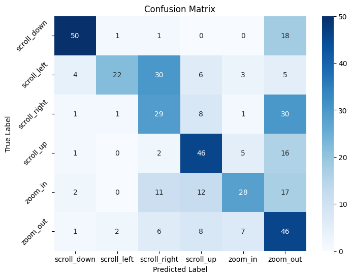
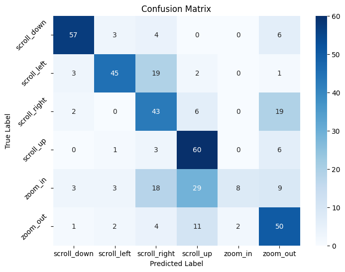

# Training on hand extracted features

## Model config

model.compile(
    optimizer=keras.optimizers.Adam(learning_rate=1e-3),
    loss=keras.losses.CategoricalCrossentropy(),  # Use categorical crossentropy for multi-class classification
    metrics=['accuracy']
)

history = model.fit(X, y, epochs=10, batch_size=32, validation_split=0.2)

Epoch 10/10
28/28 ━━━━━━━━━━━━━━━━━━━━ 99s 4s/step - accuracy: 0.9982 - loss: 0.0054 - val_accuracy: 0.9148 - val_loss: 0.3200

Test Loss: 0.3317
Test Accuracy: 0.9204

# Training on transformed extracted pose features

## Model config

model = keras.models.Sequential()

model.add(keras.layers.LSTM(2048,
                            activation='tanh',
                            dropout=0.3,  
                            recurrent_dropout=0.3,
                            kernel_regularizer=keras.regularizers.l2(1e-3),  
                            input_shape=(X.shape[1], 2048)))

model.add(keras.layers.Dense(512, activation='relu', kernel_regularizer=keras.regularizers.l2(1e-3)))
model.add(keras.layers.Dropout(0.4))  

model.add(keras.layers.Dense(6, activation='softmax'))

model.compile( 
    optimizer=keras.optimizers.Adam(learning_rate=1e-5),
    loss=keras.losses.CategoricalCrossentropy(),  # Use categorical crossentropy for multi-class classification
    metrics=['accuracy']
)

early_stopping = keras.callbacks.EarlyStopping(
    monitor='val_loss',  
    # min_delta= 0.5,
    patience=10,  # Numero di epoche senza miglioramenti prima di fermarsi
    restore_best_weights=True  # Ripristina i pesi migliori
)

history = model.fit(
    X,
    y,
    epochs=300,
    batch_size=64,
    validation_split=0.2,
    shuffle=True,
    callbacks=[early_stopping]  # Aggiunti i callback
)

Epoch 300/300
45/45 ━━━━━━━━━━━━━━━━━━━━ 11s 149ms/step - accuracy: 0.9305 - loss: 2.0625 - val_accuracy: 0.8951 - val_loss: 2.1564

14/14 ━━━━━━━━━━━━━━━━━━━━ 1s 34ms/step - accuracy: 0.9322 - loss: 2.0894
Test Loss: 2.1894
Test Accuracy: 0.9071

# Training on hand extracted features

## Model config

model.compile(
    optimizer=keras.optimizers.Adam(learning_rate=1e-3),
    loss=keras.losses.CategoricalCrossentropy(),  # Use categorical crossentropy for multi-class classification
    metrics=['accuracy']
)

history = model.fit(X, y, epochs=10, batch_size=32, validation_split=0.2)

Epoch 10/10
28/28 ━━━━━━━━━━━━━━━━━━━━ 99s 4s/step - accuracy: 0.9982 - loss: 0.0054 - val_accuracy: 0.9148 - val_loss: 0.3200

Test Loss: 0.3317
Test Accuracy: 0.9204

## Data Hands crop, well splitted dataset 

model = keras.models.Sequential()

model.add(keras.layers.LSTM(2048,
                            activation='tanh',
                            recurrent_activation='sigmoid',
                            dropout=0.5,
                            recurrent_dropout=0.5,
                            kernel_regularizer=keras.regularizers.l2(1e-4),
                            input_shape=(X.shape[1], 2048)))

\# Aggiunta di Batch Normalization dopo LSTM
model.add(keras.layers.BatchNormalization())

model.add(keras.layers.Dense(512, activation='relu', kernel_regularizer=keras.regularizers.l2(1e-3)))

\# Aggiunta di Batch Normalization dopo Dense
model.add(keras.layers.BatchNormalization())

model.add(keras.layers.Dropout(0.5))

model.add(keras.layers.Dense(6, activation='softmax'))

model.compile(
    optimizer=keras.optimizers.Adam(learning_rate=1e-5),
    loss=keras.losses.CategoricalCrossentropy(),  # Use categorical crossentropy for multi-class classification
    metrics=['accuracy']
)

early_stopping = keras.callbacks.EarlyStopping(
    monitor='val_loss',
    patience=20,  # Numero di epoche senza miglioramenti prima di fermarsi
)

history = model.fit(
    X,
    y,
    epochs=300,
    batch_size=64,
    validation_split=0.1,
    shuffle=True,
    callbacks=[early_stopping]
)

Epoch 134/300
16/16 ━━━━━━━━━━━━━━━━━━━━ 2s 139ms/step - accuracy: 0.9295 - loss: 0.5878 - val_accuracy: 0.7544 - val_loss: 1.0716

3/3 ━━━━━━━━━━━━━━━━━━━━ 0s 46ms/step - accuracy: 0.8490 - loss: 0.7567
Test Loss: 0.8669
Test Accuracy: 0.8152

# Training on no crop extracted features, well splitted dataset

## Model config

model = keras.models.Sequential()

model.add(keras.layers.LSTM(2048,
                            activation='tanh',
                            recurrent_activation='sigmoid',
                            dropout=0.5,
                            kernel_regularizer=keras.regularizers.l2(1e-2),
                            recurrent_dropout=0.5,
                            input_shape=(X.shape[1], 2048)))

model.add(keras.layers.BatchNormalization())

model.add(keras.layers.Dense(512, activation='relu', kernel_regularizer=keras.regularizers.l2(1e-2)))

model.add(keras.layers.BatchNormalization())

model.add(keras.layers.Dropout(0.5))

model.add(keras.layers.Dense(6, activation='softmax'))

model.compile(
    optimizer=keras.optimizers.Adam(learning_rate=1e-4),
    loss=keras.losses.CategoricalCrossentropy(),  
    metrics=['accuracy']
)

early_stopping = keras.callbacks.EarlyStopping(
    monitor='val_loss',
    patience=10,  
)

history = model.fit(
    X,
    y,
    epochs=300,
    batch_size=64,
    validation_split=0.1,
    shuffle=True,
    callbacks=[early_stopping]
)

### run 1

accuracy: 0.5960 - loss: 1.6499
Test Loss: 2.1136
Test Accuracy: 0.5262

### run 2

Epoch 109/300
53/53 ━━━━━━━━━━━━━━━━━━━━ 7s 140ms/step - accuracy: 0.9704 - loss: 0.4959 - val_accuracy: 0.9122 - val_loss: 0.6875

accuracy: 0.5252 - loss: 1.9556

Test Loss: 1.9762 - Test Accuracy: 0.5381

## Model config 

model = keras.models.Sequential()

model.add(keras.layers.LSTM(2048,
                            activation='tanh',
                            recurrent_activation='sigmoid',
                            dropout=0.5,
                            kernel_regularizer=keras.regularizers.l2(1e-2),
                            recurrent_dropout=0.5,
                            input_shape=(X.shape[1], 2048)))

model.add(keras.layers.BatchNormalization())

model.add(keras.layers.Dense(512, activation='relu', kernel_regularizer=keras.regularizers.l2(1e-2)))

model.add(keras.layers.BatchNormalization())

model.add(keras.layers.Dropout(0.5))

model.add(keras.layers.Dense(6, activation='softmax'))

model.compile(
    optimizer=keras.optimizers.Adam(learning_rate=1e-4),
    loss=keras.losses.CategoricalCrossentropy(),  
    metrics=['accuracy']
)

early_stopping = keras.callbacks.EarlyStopping(
    monitor='val_loss',
    patience=10,  
)

history = model.fit(
    X,
    y,
    epochs=100,
    batch_size=64,
    validation_split=0.1,
    shuffle=True,
    callbacks=[early_stopping]
)

# run 1

Epoch 100/100
53/53 ━━━━━━━━━━━━━━━━━━━━ 10s 134ms/step - accuracy: 0.9726 - loss: 0.5947 - val_accuracy: 0.9282 - val_loss: 0.7390

accuracy: 0.7267 - loss: 1.4583

Test Loss: 2.0201 - Test Accuracy: 0.6262

